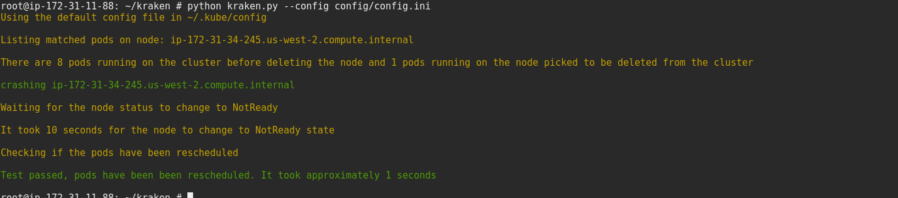
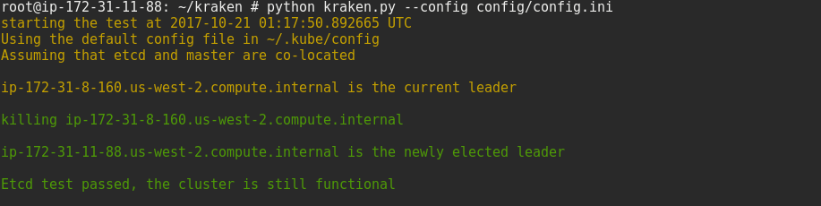
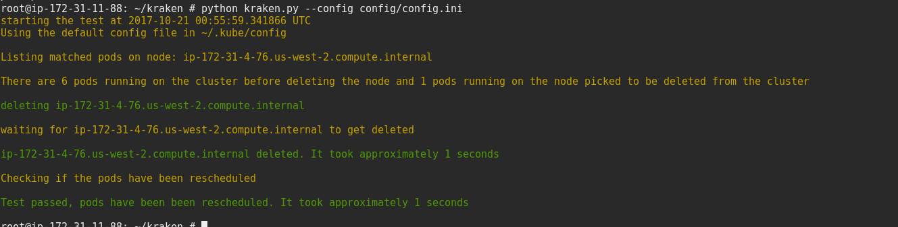
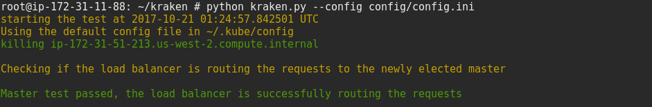

# kraken
Resiliency tool for openshift

### Install the dependencies
```
$ pip install --upgrade setuptools
$ pip install -r requirements.txt
```

## Scenarios covered
### Node is offline or deleted
- Kraken deletes a random node and checks if the pods running on the node gets rescheduled on some other node. 

### Node crash
- kraken picks a random node, crashes it using fork bomb and checks if the pods running on the node gets rescheduled on some other node.

Note: The machine needs to be rebooted in order to recover form fork bomb.

### Kill Master
- Kraken takes down a master which is the current leader in a high availability environment and checks if the load balancer is still routing the requests to one of the master.

### Kill etcd
#### Possible scenarios:
- Kill random node
- Kill leader node
- Kill majority of nodes in cluster
- Kill node for a long time to trigger snapshot when it comes back
- Network partition
- Slow network

#### Scenarios covered:
- kill leader node

Kraken kills the leader and checks:
- if a new leader is elected.
- if the cluster is still functional.

### Label master, worker nodes
- Master node needs to be labeled with node_type=master so that the tool doesn't delete the master which will cause problems when we don't have a high availability cluster.
- Worker nodes needs to be labeled with node_type=kraken, kraken looks for that label when picking up the random node to delete.
- Make sure to label the master nodes with node_type=kraken in case you want to run master and etcd failure tests.

The labeling can be done by using the openshift-labeler playbook present in the repo or using the oc client like:
```
$ oc label node <node> <label>
$ oc label node <node> node_type=kraken
```

### kraken config
Set the master_label, label with the labels given to the master, worker nodes in the config. For example:
```
[kraken]
master_label: node_type=master
label: type=kraken
test_type: kill_node
test_type: crash_node
test_type : kill_etcd
test_type: kill_master
```

### Run
```
$ python kraken.py --config config/config.ini  
```
## Node crash


## Etcd is killed


## Node is offline


## Master is killed

