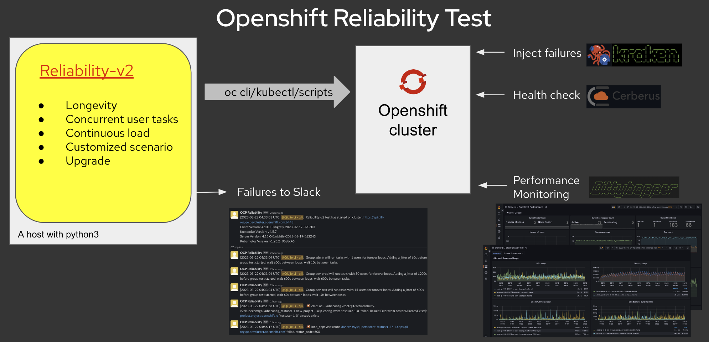

OpenShift V4 Reliability - V2
# Introduction
Reliability-v2 is a longevity test tool simulating customer actions with load, integrated with health check, error injection and failure & performance monitoring.
It can support OCP cluster and ROSA/ROSA Hypershift cluster.

## Overview


## Source
Get the reliability-v2 tool from this git repo
```
$ git clone git@github.com:openshift/svt.git
cd svt/reliability-v2
```

# Quick Start
## Tmux
[tmux](https://github.com/tmux/tmux/wiki) is a tool that can help to keep the reliability running in the background to avoid the termination of the run due to the unexpected termination of the terminal. Ad reliability test sometimes run for several days, we recommend you to run reliability in a tmux session.

## Generate auth files automatically with script
[generate_auth_files.sh](https://github.com/openshift/svt/blob/master/reliability-v2/utils/generate_auth_files.sh) can help you to generate the required files mentioned above. Get the command's help with generate_auth_files.sh -h.

#### Pre-requisite:
 - [oc cli](https://console.redhat.com/openshift/downloads)

For classic rosa and rosa hypershift cluster, additional pre-requisite:

 - [rosa cli](https://console.redhat.com/openshift/downloads)

 - [ocm cli](https://console.redhat.com/openshift/downloads)

 - [aws configuration](https://docs.google.com/document/d/1j7bhLXT_cIAjpMh_x2jeegtpE7495Mj5A-EcQsgZEDo)

## A quick start script: start.sh
[start.sh](https://github.com/openshift/svt/tree/master/reliability-v2/start.sh) is a quick start script that helps you to do nessessary preparations and generate a default configurations based on [example_reliability.yaml](https://github.com/openshift/svt/blob/master/reliability-v2/config/example_reliability.yaml) and start a reliability test to run for a certain time. It can upgrade the cluster every 24 hours if there is new nightly build.

e.g. Run reliability test for 7 days with the default configuration and upgrade the cluster every 24 hours if there is new nightly build
```
start.sh -p <absolute path to the folder holding kubeconfig, admin and users files> -t 7d -u
```

To enable slack notification, export either of the following env viriables before running start.sh
export SLACK_WEBHOOK_URL OR SLACK_API_TOKEN, find them in https://vault.bitwarden.com 'Red Hat, Inc. vault' 'perfscale-reliability-credentials' item.

To make you tagged in the slack notification, export the following env virable.
export SLACK_MEMBER=<get it by clicking 'Copy member ID' in your slack Profile>

If you don't want to use the default configuration, you can update (https://github.com/openshift/svt/blob/master/reliability-v2/config/example_reliability.yaml) before you trigger [start.sh](https://github.com/openshift/svt/tree/master/reliability-v2/start.sh)

For configuration details, check [Configuration](#Configuration)

# Run without start.sh
If [start.sh](https://github.com/openshift/svt/tree/master/reliability-v2/start.sh) can not fit your requirment, you can run it with python. Read the folowing steps to know more details.

## Install dependencies
**NOTE**: Recommended to use a virtual environment(pyenv,venv) so as to prevent conflicts with already installed packages.
```
$ pip3 install -r requirements.txt
```

## Prepare Authentication files
You need to prepare 3 files
1. kubeconfig
2. admin: a file contains pairs of username and password of user which is admin role. e.g. kubeadmin:password (No space)
3. users: a file contains pairs of usernames and passwords. e.g testuser-0:password1,testuser-1:password2,...,testuser-n:passwordn (No space)
Use either of the options below to generate the 3 files.

### Option 1: Generate auth files automatically with script
[generate_auth_files.sh](https://github.com/openshift/svt/blob/master/reliability-v2/utils/generate_auth_files.sh) can help you to generate the required files mentioned above. Get the command's help with generate_auth_files.sh -h.

#### Pre-requisite:
 - [oc cli](https://console.redhat.com/openshift/downloads)

For classic rosa and rosa hypershift cluster, additional pre-requisite:

 - [rosa cli](https://console.redhat.com/openshift/downloads)

 - [ocm cli](https://console.redhat.com/openshift/downloads)

 - [aws configuration](https://docs.google.com/document/d/1j7bhLXT_cIAjpMh_x2jeegtpE7495Mj5A-EcQsgZEDo)

### Option 2: Generate auth files manually
 - If you installed your cluster with [Flexy-install](https://mastern-jenkins-csb-openshift-qe.apps.ocp4.prod.psi.redhat.com/job/ocp-common/job/Flexy-install/) Jenkins job, download kubeconfig, users.spec and kubeadmin-password files from the Build Artifacts after the job completed successfully. The user `kubeadmin` has admin priviledge and its password is in kubeadmin-password. users.spec contains username and password pairs of 50 test users. Then compose the above 3 files based on the files you get.

  - If you installed your rosa/rosa hypershift cluster with [ocm-profile-ci](https://mastern-jenkins-csb-openshift-qe.apps.ocp-c1.prod.psi.redhat.com/job/ocm/job/ocm-profile-ci) Jenkins job. Go to [Option 1](#Option-1-Generate-auth-filesautom-atically-with-script).


 - If you installed your rosa/rosa hypershift cluster with Prow CI, follow below instruction to get the kubeconfig, admin credential file and users credential files. Then compose the above 3 files based on the files you get.

1. Open the job , find the link following "Using namespace".
2. Open the link you get above and login, click your name on right top of the console, choose "Copy login command". You may need to open the link in a new incognito window in Chrome to get the token.
3. Login the cluster with the token.
4. Run 'oc get pods' and find the running pod of your test.
5. Run 'oc rsh <pod_name>'
6. 'cat /tmp/kubeconfig-xxx' to get the content of kubeconfig.
7. 'cat /tmp/secret/api.login' to get the usernames and passwords from the output, and put them in the admin file in the format of username:password.
8. 'cat ${SHARED_DIR}/runtime_env' to get the usernames and passwords from the output, and put them in the users file in the format of testuser-0:password1,testuser-1:password2,...,testuser-n:passwordn.

Replace `kubeconfig` `admin_file` and `user_file` with above files 1. 2. 3. in your config yaml file.
```yaml
reliability:
  kubeconfig: <absolute_path_to_kubeconfig>
  users:
    - admin_file: <path_to_admin_file>
    - user_file: <path_to_users_file>
```

## Prepare Configuration
Example [config](https://github.com/openshift/svt/blob/master/reliability-v2/config/example_reliability.yaml). 

You can customize the configuration file, check [Configuration](#Configuration) for details.

### Groups and Tasks
Define your test scenario by adding [Groups and Tasks](Groups-And-Tasks).

### Integration
[Slack Integration](#Slack-Integration) 

If you want to receive notifications about the start stop of the test and errors happen during the Reliability test, configure Slack Integration before running the Reliability test.

[Cerberus Integration](#Cerberus-Integration) 

If you want to leverage Cerberus to check the health of the cluster and take action during the Reliability test, configure Cerberus Integration before running the Reliability test.

[Kraken Integration](#Kraken-Integration)

If you want to add [Kraken](https://github.com/cloud-bulldozer/kraken-hub) to inject chaos during the Reliability test, configure Kraken Integration before running the Reliability test.


## Run

```
python3 reliability.py -c <path to the configuration file>
```
`-l` and `--cerberus-history` are optional.

Logs will go to stdout and `/tmp/reliability.log` by default if `-l` is not specified.

Cerberus history file will go to `/tmp/cerberus-history.json` by default if `--cerberus-history` is not specified.
```
python3 reliability.py -c <path to config file> -l <path to log config file> --cerberus-history <path to file to save cerberus history is cerberus is enabled>
```

## Pause and Stop 
In the directory where you start reliability test:
```bash
# pause execution
touch pause
# resume from pause
rm pause
# clean shutdown at end of next loop
touch halt
```

# Configuration
Example [config](https://github.com/openshift/svt/blob/master/reliability-v2/config/example_reliability.yaml). Below sections explains each part of the configuration file.

## Groups and Tasks
A group defines a group of users with the similar behavior, they will run the same tasks. You can use any meaningful name for a group

`user_name` the name of test user. If user_start and user_end exist, this will be username prefix

`user_start` and `user_end` it defines the start and end range of users. `user_start` is inclusive, `user_end` is exclusive.

`loops` defines the number of times each user will run the tasks. default is 1.

`trigger` defines the time in second to wait between each loop. 

`jitter` defines a random time in second to be added at the start of the first loop for a user. The purpose is to let users in a group to start at a different time. Default is 0.

`tasks` define a list of tasks to run by a user. Each user will run the tasks in serial for the defined loops.

`interval` defines the time in second to wait between each task in a tasks list.

`pre_tasks` will be run only once before the loop(s).

`post_tasks` will be run only once after the loop(s).

All users in a group run in parrellel. All groups run in parrellel.

For tasks, oc cli, kubeconfig, shell script and build-in [func](Supported-Func)s are supported.

```yaml
reliability:
  groups:
    - name: admin
      # For cluster created by Jenkins Flexy-install job, the admin user_name is kubeadmin.
      # For rosa cluster created in Prow, the admin user_name is rosa-admin.
      user_name: <admin_username> # admin username as kubeadmin or rosa-admin.
      loops: forever # run group for loops times. integer > 0 or 'forever', default is 1.
      trigger: 600 # wait trigger seconds between each loop
      jitter: 60 # randomly start the users in this group in trigger seconds. Default is 0.
      interval: 10 # wait interval seconds between tasks.
      tasks: 
        - func check_operators
        - oc get project -l purpose=reliability
        - func check_nodes
        - kubectl get pods -A -o wide | egrep -v "Completed|Running"
        # Run test case as scripts. KUBECONFIG of the current user is set as env variable by reliability-v2. 
        #- . <path_to_script>/create-delete-pod-ensure-service.sh

    - name: dev-test
      user_name: testuser- # if user_start and user_end exist, this will be username prefix
      # For cluster created by Jenkins Flexy-install job, the users start from testuser-0
      # For cluster created in Prow and used the following step to create test users, the users start from testuser-1. 
      # https://github.com/openshift/release/blob/master/ci-operator/step-registry/osd-ccs/conf/idp/htpasswd/multi-users/osd-ccs-conf-idp-htpasswd-multi-users-ref.yaml
      user_start: 1 # user_start is inclusive, start with testuser-1 in the users file. 
      user_end: 11 # user_end is exclusive, end with testuser-10 in the users file
      loops: forever
      trigger: 60
      jitter: 600 # randomly start the users in this group in 10 minutes
      interval: 10
      tasks:
        - func delete_all_projects # clear all projects
        - func verify_project_deletion 2 # verfy project deletion in 2 namespaces
        - func new_project 2 # new 2 projects
        # If network policy is planed in the test, uncomment the following line
        #- func apply 2 "<path_to_content>/allow-same-namespace.yaml" # Apply network policy to 2 projects
        - func check_all_projects # check all project under this user
        - func new_app 2 # new app in 2 namespaces
        - func load_app 2 10 # load apps in 2 namespaces with 10 clients for each
        - func build 1 # build app in 1 namespace
        - func check_pods 2 # check pods in 2 namespaces 
        - func delete_project 2 # delete project in 2 namespaces
        - func verify_project_deletion 2 # verfy project deletion in 2 namespaces

    - name: dev-prod
      user_name: testuser- 
      user_start: 15
      user_end: 16
      loops: forever
      trigger: 600
      jitter: 1200
      interval: 600
      pre_tasks: 
          - func delete_all_projects
          - func verify_project_deletion 2
          - func new_project 2
          - func new_app 2
      tasks:
        - func load_app 2 10 
        - func scale_deployment 2 2 # scale app in 2 namespaces to 2 replicas
        - func scale_deployment 2 1 # scale app in 2 namespaces to 1 replicas
      post_tasks: 
        - func delete_project 2
```
## Supported func
Funs are some build-in functions that calls oc cli to run some common operation(s).

The following funcs are supported now:

| name | parameters | user | comment |
| ---- | ---- | ---- | ---- |
| delete_all_projects  | N/A | developer | delete all projects for a user | 
| new_project | number_of_projects | developer | Create n projects for the user|
| check_all_projects  | N/A | developer | Check projects under the user|
| new_app  | number_of_projects | developer | New an app under each project|
| load_app  | number_of_projects  number_of_clients | developer | Load an app under each project with a number of clients|
| apply  | number_of_projects  file_location | developer admin | apply a file under each project|
| build  | number_of_projects | developer | Build under each project|
| scale_deployment  | number_of_projects number_of_replicas | developer | Scaleup the deployment to number_of_replicas replicas under each project|
| check_pods  | number_of_projects | developer | Check pods under each project|
| delete_project  | number_of_projects | developer | Delete each project|
| check_operators  | N/A | admin | Check Degraded operators|
| check_nodes  | N/A | admin | Check not Ready nodes|

## Slack Integration
Receive notifications about the start stop of the Reliability test and errors happen during the Reliability test.

Export the either of the follwoing environment virables before running the test.
If SLACK_API_TOKEN fails to work, the workaround is to export SLACK_WEBHOOK_URL.
Find them in https://vault.bitwarden.com 'Red Hat, Inc. vault' 'perfscale-reliability-credentials' item.

```yaml
  slackIntegration:
    slack_enable: False
    # the ID in the example is the id of slack channel #ocp-qe-reliability-monitoring.
    slack_channel: C0266JJ4XM5
    # slack_member is optional. If provided, the notification message will @ you. 
    # you must be a member of the slack channel to receive the notification.
    slack_member: <Your slack member id>
```
In the above configuration, notifications will be sent to [#ocp-qe-reliability-monitoring](https://coreos.slack.com/archives/C0266JJ4XM5) (Channel ID: C0266JJ4XM5) in [CoreOS](coreos.slack.com) workspace, and @ the user of slack_member if you configured.

If you're in [CoreOS](coreos.slack.com) workspace, but you want to use your own slack channel, create a slack channel and install App `OCP Reliability` which already exists in CoreOS workspace.

If you want to use your own App(slack_api_token), create an [app](https://api.slack.com/apps?new_granular_bot_app=1) and add a bot to it on slack. Slack Bot Token Scopes permissions are [channels:read] [chat:write] [groups:read] [im:read] [mpim:read]. You will get a token after the app is installed to a workspace. Install the app to your channel. Set the token to SLACK_API_TOKEN environment variable. Since 2023-4-30 Slack Bot api with token has to be approved before it can be installed.

## Cerberus Integration
Reliablity can integrate with [Cerberus](https://github.com/cloud-bulldozer/cerberus) to check the healthy of the cluster and take action accordingly during the Reliability test.

The below configuration example enables the Cerberus integration `cerberus_enable: True`, and provided the Cerberus api `cerberus_api: "http://0.0.0.0:8080"` where Reliability test can get the [Cerberus status and history](https://github.com/cloud-bulldozer/cerberus#metrics-api) from. The `cerberus_fail_action` configures how Reliability test acts when Cerberus status is False.

`pause`: When Cerberus status is 'False', pause Reliability test until Cerberus status is changed to 'True'.

`halt`: When Cerberus status is 'False', halt(end) Reliablity test.

`continue`: When Cerberus status is 'False', continue Reliability test and warn the False status in Reliability log.

**NOTE:** If cerberusIntegration is enabled, no matter which `cerberus_fail_action` is used,  when there is update of Cerberus' history, the new history will be saved to a file. See [Run](#Run) section below for configuring of the file.

**NOTE:** If Cerberus Integration is enabled, start Cerberus before reliability test.
```yaml
reliability:
  cerberusIntegration:
    # start cerberus https://github.com/cloud-bulldozer/cerberus before starting reliabiity test.
    cerberus_enable: True
    # if cerberus_enable is false, the following 2 items are ignored.
    cerberus_api: "http://0.0.0.0:8080"
    # action to take when cerberus status is False, valid data: pause/halt/continue
    cerberus_fail_action: pause
```

## Kraken Integration
Configure Kraken scenario(s) to trigger error injection during the Reliability test.

The below configuration example enables the Kraken integration by setting `kraken_enable: True`. 
`kraken_scenarios` defines the [Kraken scenario(s)](https://github.com/cloud-bulldozer/kraken-hub/blob/main/README.md#supported-chaos-scenarios) you want to run during Reliability test. Refer to each Kraken scenario's document for the supported `parameters`, e.g [pod-scenarios](https://github.com/cloud-bulldozer/kraken-hub/blob/main/docs/pod-scenarios.md#supported-parameters).

`interval_unit` and `interval_number` schedules how often the Kraken scenario is triggered. `start_date` and `end_date` with `timezone` are used to limit the time range to schedule the Kraken scenario. The scheduler feature makes use of [apscheduler](https://apscheduler.readthedocs.io/en/latest/modules/triggers/interval.html#module-apscheduler.triggers.interval).

Though Kraken senarios support to run the error injection multiple times with iterations or in daemon mode as parameter, in Reliability test, you may want to get notification of start and end time of each error injection, to check what errors happen in Reliability test during the error injection period. In this case, configure in Reliability test to trigger the Kraken snario with `interval_unit` and `interval_number` is recommended.

If [Slack Integration](#Slack-Integration) is enabled, notification of the Kraken scenarios' start and end time as well as result will be send to the slack channel. You can check what errors of Reliability test happen during the Kraken error injection.

```yaml
    kraken_scenarios: 
      - name: pod-scenarios_etcd
        scenario: "pod-scenarios"
        interval_unit: minutes # weeks,days,hours,minutes,seconds
        interval_number: 8
        # start_date: "2021-10-28 17:36:00" # Optional. format: 2021-10-20 10:00:00.
        # end_date: "2021-10-28 17:50:00" # Optional.
        # timezone: "Asia/Shanghai" # Optional. e.g. US/Eastern. Default is "UTC
      - name: pod-scenarios_monitoring
        scenario: "pod-scenarios"
        interval_unit: minutes # weeks,days,hours,minutes,seconds
        interval_number: 10
        parameters:
          NAMESPACE: openshift-monitoring
          POD_LABEL: app.kubernetes.io/component=prometheus
          EXPECTED_POD_COUNT: 2
      - name: node-scenarios_workerstopstart
        scenario: "node-scenarios"
        interval_unit: minutes
        interval_number: 12
        parameters:
          AWS_DEFAULT_REGION: us-east-2
          AWS_ACCESS_KEY_ID: xxxx
          AWS_SECRET_ACCESS_KEY: xxxx
          CLOUD_TYPE: aws
```
